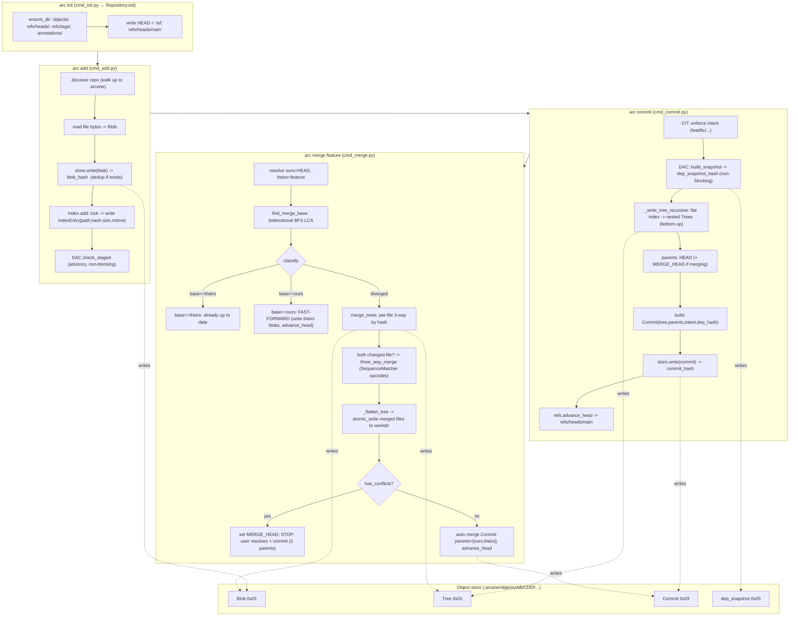

# Arcane Lifecycle Trace: `init → add → commit → merge`

This document traces a complete Arcane workflow end to end, function by function,
showing what happens on disk and in memory at each step. Every reference is
`file:line` from the actual source so you can jump straight to the code.

A companion Mermaid diagram lives at [`lifecycle-trace.mmd`](./lifecycle-trace.mmd)
(and is also embedded inline below).

---

## Scenario

We simulate this session:

```bash
arc init
echo "print('hi')"   > app.py
echo "shared code"   > utils/lib.py
arc add app.py utils/lib.py
arc commit -m "initial" -i feat

# ... later, on a branch "feature", app.py was changed and committed there ...
arc merge feature
```

Three-tier model to keep in mind throughout:

```
HEAD commit  →  the last committed snapshot   (immutable object graph)
Index        →  the staged snapshot           (.arcane/index)
Working dir  →  your actual files on disk
```

---

## Stage 0 — Foundations every stage reuses

Before the trace, three primitives that every command leans on.

### Content addressing (`objects/base.py`)

Every stored object is `[1-byte type prefix] + [zlib(msgpack(to_dict()))]`, and its
identity is the SHA-256 of those exact bytes.

- `ArcObject.serialize()` — `base.py:33-37` — prepends the type byte
  (`\x01` blob, `\x02` tree, `\x03` commit, `\x04` annotation, `\x05` dep_snapshot).
- `ArcObject.hash()` — `base.py:39-41` — `sha256(serialize())`.
- `serialization.encode/decode` — `utils/serialization.py:8-20` — msgpack + zlib.

Consequence: identical content → identical hash → written once (dedup), and any
tampering changes the hash (integrity).

### The object store (`core/store.py`)

- `ObjectStore.write(obj)` — `store.py:44-51` — serializes, computes the hash,
  writes to `.arcane/objects/AB/CDEF…` **only if it doesn't already exist**
  (that `if not path.exists()` is the dedup).
- Path fan-out — `hashing.py:21-27` — first 2 hex chars are the directory.
- `read()` — `store.py:59-69` — reads the type byte, dispatches to the right class.

### Atomic writes & locks (`utils/fs.py`)

- `atomic_write` — `fs.py:10-34` — write to a temp file, then `os.replace` (with a
  Windows unlink-then-rename fallback). No half-written objects, ever.
- `locked` — `fs.py:42-64` — an `O_EXCL` lockfile context manager used by the index.

---

## Stage 1 — `arc init`

**Command:** `cli/cmd_init.py:12-19` → **`Repository.init(target)`** (`repository.py:56-70`).

Step by step (`repository.py:56-70`):

1. Compute `arcane_dir = path/.arcane`; raise `FileExistsError` if it already exists.
2. `ensure_dir` (`fs.py:67-70`) creates four directories:
   - `.arcane/objects/`
   - `.arcane/refs/heads/`
   - `.arcane/refs/tags/`
   - `.arcane/annotations/`
3. `atomic_write_text(.arcane/HEAD, "ref: refs/heads/main\n")` — HEAD now points at
   the `main` branch **symbolically**. Note: `refs/heads/main` does **not** exist yet —
   there are no commits. `resolve_head()` will return `None` until the first commit.
4. Return a `Repository`, whose `__init__` (`repository.py:26-31`) wires up the three
   subsystems: `ObjectStore`, `RefsManager`, `Index` (empty — no index file yet).

**On-disk result:**

```
.arcane/
├── HEAD                → "ref: refs/heads/main"
├── objects/            (empty)
├── refs/heads/         (empty — main not born yet)
├── refs/tags/          (empty)
└── annotations/        (empty)
```

---

## Stage 2 — `arc add app.py utils/lib.py`

**Command:** `cli/cmd_add.py:15-50`.

1. `Repository.discover(cwd)` — `repository.py:35-52` — walks **up** the directory
   tree until it finds a `.arcane/`; raises `NotARepositoryError` otherwise.
2. For each path argument (`cmd_add.py:22-43`):
   - If it's a directory, expand to all files via `rglob("*")`; otherwise a single file.
   - Skip anything inside `.arcane/` (`cmd_add.py:31-36`).
   - `rel = repo_relative(root, file)` — `fs.py:73-75` — repo-relative POSIX path
     (e.g. `utils/lib.py`).
   - Read raw bytes → `Blob(content)` (`objects/blob.py:8-14`).
   - **`repo.store.write(blob)`** — the file content is written to the object store
     **right now, at add time** (not at commit). Returns `blob_hash`.
   - **`repo.index.add(rel, blob_hash, file_path)`** — records the staging entry.
3. DAC advisory hook `check_staged(repo)` (`cmd_add.py:46-50`) — warns if a staged
   file imports an unstaged dependency. Wrapped in try/except: **never blocks add**.

### Inside `Index.add` (`core/index.py:72-84`)

```python
with locked(self.lock_path):     # .arcane/index.lock — exclusive
    self._load()                 # re-read to avoid clobbering concurrent writes
    self._entries[path] = IndexEntry(
        path=path, hash=blob_hash, mode=0o100644,
        size=stat.st_size, mtime=stat.st_mtime,   # ← cheap change-detection cache
    )
    self._save()                 # atomic_write of msgpack+zlib
```

The `size`+`mtime` fields are the key optimization: `diff_vs_workdir`
(`index.py:109-121`) later flags a file dirty by comparing size/mtime instead of
re-hashing every file.

**On-disk result after add:**

```
.arcane/objects/<h1>   → Blob("print('hi')\n")        # app.py content
.arcane/objects/<h2>   → Blob("shared code\n")        # utils/lib.py content
.arcane/index          → { entries: [
                             {path:"app.py",       hash:h1, size, mtime},
                             {path:"utils/lib.py", hash:h2, size, mtime},
                         ]}
```

Two objects and an index. Still **zero commits**.

---

## Stage 3 — `arc commit -m "initial" -i feat`

**Command:** `cli/cmd_commit.py:60-125`.

1. `Repository.discover(cwd)`.
2. **CIT — enforce intent** (`cmd_commit.py:67-75`): `-i` is validated against
   `VALID_INTENTS` (`cmd_commit.py:13`); if omitted, the user is *prompted* — a commit
   cannot exist without an intent. Result: `intent_meta = {"type":"feat", "scope":None, "breaking":False}`.
3. **DAC — dependency snapshot** (`cmd_commit.py:78-83`): `build_snapshot(repo)` parses
   all tracked files, builds the dependency graph, stores it as a `dep_snapshot` object,
   returns `dep_snapshot_hash`. Wrapped in try/except — **non-blocking**.
4. **Build the tree** — `_build_tree_from_index` → `_write_tree_recursive`
   (`cmd_commit.py:16-47`). See below.
5. **Determine parents** (`cmd_commit.py:89-95`):
   - HEAD resolves to `None` (first commit) → no parent → `parents = []`.
   - If a merge were in progress, `MERGE_HEAD` would be appended as a second parent.
6. Build the `Commit` object (`cmd_commit.py:100-111`) with tree, parents, author,
   timestamps, message, `intent_meta`, `dep_snapshot_hash`.
7. **`repo.store.write(commit_obj)`** → `commit_hash`.
8. **`repo.refs.advance_head(commit_hash)`** — writes the hash into `refs/heads/main`
   (`refs.py:69-74` → `update_current_branch` → `update_branch`). **This is the moment
   `main` is born.**
9. If merging, `clear_merge_head()`.

### Building the tree — flat index → nested trees

`_write_tree_recursive` (`cmd_commit.py:27-47`) turns the flat
`{"app.py": h1, "utils/lib.py": h2}` map into a directory hierarchy, **bottom-up**:

- Split each path on the first `/`.
  - `app.py` → single segment → a `TreeEntry(blob, mode 0o100644)` in the root.
  - `utils/lib.py` → grouped under `dirs["utils"] = {"lib.py": h2}`.
- Recurse into `utils/` first: build a subtree containing `lib.py`, `store.write` it →
  `subtree_hash`. Add `TreeEntry(name="utils", hash=subtree_hash, mode 0o040000, tree)`
  to the root.
- `Tree.__init__` sorts entries by name (`objects/tree.py:40-43`) so the serialization
  (and therefore the hash) is deterministic.
- `store.write(root_tree)` → `root_tree_hash`.

Resulting object graph:

```
Commit(feat, parents=[])
  └─ tree ─→ Tree(root)
               ├─ app.py            → Blob(h1)
               └─ utils (subtree)   → Tree(utils)
                                        └─ lib.py → Blob(h2)
```

The commit hash transitively fingerprints the entire tree + all metadata. Because
blobs `h1`/`h2` were already written at add time, `store.write` for them would be a
no-op — only the two `Tree` objects and the `Commit` are new.

**On-disk result after commit:**

```
.arcane/refs/heads/main   → <commit_hash>          # main now exists
.arcane/HEAD              → "ref: refs/heads/main" # unchanged (still symbolic)
.arcane/objects/...       → + Tree(root), Tree(utils), Commit, dep_snapshot
```

History is now a DAG with one node. Walking history = follow `commit.parents`.

---

## Stage 4 — `arc merge feature`

Assume branch `feature` diverged: it changed `app.py` and made its own commit.
`refs/heads/feature` points at commit `T` (theirs); `refs/heads/main` points at `O`
(ours). Their common ancestor is `B` (base).

**Command:** `cli/cmd_merge.py:18-102`.

### 4a. Resolve and guard (`cmd_merge.py:20-43`)

1. `Repository.discover`.
2. Reject if already merging (`is_merging()` checks for `MERGE_HEAD`, `repository.py:95-96`).
3. `ours_hash = refs.resolve_head()` — current tip `O`.
4. `theirs_hash = refs.resolve("feature")` — `refs.resolve` (`refs.py:127-141`) tries
   HEAD → branch → tag → raw hash. Returns `T`.
5. If `ours == theirs`, "Already up to date" and stop.

### 4b. Find the merge base — bidirectional BFS (`merge.py:103-136`)

`find_merge_base(store, O, T)` runs **two BFS frontiers backward through the parent
DAG simultaneously**:

- `queue_a` starts at `O`, `queue_b` at `T`; `visited_a` / `visited_b` track each side.
- Each loop pops one node from each queue. If a node popped on side A is already in
  `visited_b` (or vice versa), that node is the **lowest common ancestor** → return it.
- Enqueue each popped commit's `parents`.
- Returns `None` only if histories never meet.

This meeting-in-the-middle is why it doesn't have to walk all of history — it stops
the instant the frontiers touch. Result: `base_hash = B`.

### 4c. Classify the merge (`cmd_merge.py:46-61`)

- `base == theirs` → theirs is an ancestor of ours → "Already up to date", stop.
- `base == ours` → **fast-forward**: ours is an ancestor of theirs, so there is nothing
  to merge — just adopt theirs.
  - `_flatten_tree(store, theirs.tree)` (`diff.py:87-99`) → `{path: blob_hash}`.
  - For each entry, read the blob and `atomic_write` it into the working directory
    (`cmd_merge.py:54-58`).
  - `advance_head(theirs_hash)` — move the branch pointer forward. Done. No new commit.
- Otherwise → **true 3-way merge** (our scenario: histories genuinely diverged).

### 4d. Three-way tree merge (`merge.py:139-189`)

`merge_trees(store, base_tree, ours_tree, theirs_tree)`:

1. Flatten all three trees to `{path: blob_hash}` maps.
2. For every path in the union (`merge.py:157-186`), decide per file by comparing the
   three hashes — **the fast path avoids any text merge**:

   | Condition | Resolution |
   |---|---|
   | `ours == theirs` | take it (both made the same change / no change) |
   | `ours == base` | only theirs changed → take **theirs** |
   | `theirs == base` | only ours changed → take **ours** |
   | all three differ | **both changed the same file → 3-way text merge** |

3. For the "both changed" case, decode the three blob texts and call
   `three_way_merge` (below). Write the merged text as a new `Blob`, record its hash.
4. `_build_tree_from_flat` → `_write_tree` (`merge.py:192-222`) rebuilds nested `Tree`
   objects from the merged flat map (same bottom-up construction as commit). Returns
   `(new_tree_hash, has_conflicts)`.

### 4e. Line-level 3-way text merge (`merge.py:22-100`)

`three_way_merge(base_text, ours_text, theirs_text)`:

1. Split each into lines (`keepends=True`).
2. `_extract_changes(base, side)` (`merge.py:40-49`) uses
   **`difflib.SequenceMatcher.get_opcodes()`** to list every non-`equal` region as
   `(base_start, base_end, replacement_lines)` — once for base→ours, once for base→theirs.
3. `_apply_changes` (`merge.py:52-100`) walks the base line by line:
   - Both sides changed the region at this index:
     - identical replacements → emit once;
     - different → emit conflict markers `<<<<<<< ours / ======= / >>>>>>> theirs`
       and set `has_conflicts = True`.
   - Only one side changed → take that side.
   - Neither changed → copy the base line.
4. Returns `MergeResult(merged_content, has_conflicts)`.

### 4f. Write results & finalize (`cmd_merge.py:73-102`)

1. `_flatten_tree(new_tree_hash)` and `atomic_write` every merged blob into the
   working directory (`cmd_merge.py:74-78`).
2. **If conflicts** (`cmd_merge.py:80-83`): `set_merge_head(theirs_hash)` writes
   `.arcane/MERGE_HEAD`, prints a warning, and **stops without committing**. The user
   resolves markers, `arc add`s, and `arc commit` — at which point `cmd_commit.py:93-95`
   sees `MERGE_HEAD` and records **two parents** `[O, T]`, then `clear_merge_head()`.
3. **If clean** (`cmd_merge.py:85-102`): auto-create the merge `Commit` with
   `parents=[ours_hash, theirs_hash]` and a generated message, `store.write`,
   `advance_head`. The two-parent commit is what makes this a merge in the DAG.

**On-disk result after a clean merge:**

```
.arcane/refs/heads/main → <merge_commit>            # advanced
.arcane/objects/...      → + merged Blob(s), rebuilt Tree(s), merge Commit
merge Commit.parents     → [O (main), T (feature)]  # two parents
Working directory        → merged file contents
```

---

## Cheat-sheet: which function touches which file

| Step | Entry point | Core function(s) | Writes on disk |
|---|---|---|---|
| init | `cmd_init.py:12` | `Repository.init` `repository.py:56` | `.arcane/` skeleton + HEAD |
| add | `cmd_add.py:15` | `store.write` `store.py:44`; `Index.add` `index.py:72` | blob objects + `index` |
| commit | `cmd_commit.py:60` | `_write_tree_recursive` `cmd_commit.py:27`; `store.write`; `refs.advance_head` `refs.py:69` | tree + commit + dep_snapshot objects; `refs/heads/main` |
| merge (base) | `cmd_merge.py:18` | `find_merge_base` `merge.py:103` | — |
| merge (trees) | " | `merge_trees` `merge.py:139` | merged blobs + trees |
| merge (text) | " | `three_way_merge` `merge.py:22` | — (returns text) |
| merge (finalize) | " | `refs.advance_head`; `set/clear_merge_head` `repository.py:98` | merge commit; `MERGE_HEAD` (on conflict) |

---

## Algorithms in one place

1. **Content addressing — SHA-256** (`hashing.py`): identity = hash of serialized bytes → dedup + integrity + O(1) equality.
2. **Diff — `difflib.SequenceMatcher`** (Ratcliff–Obershelp): line-level file diffs and merge change-extraction.
3. **Merge base — bidirectional BFS LCA** (`merge.py:103-136`): two frontiers expand backward until they meet.
4. **3-way merge** (`merge.py:22-100`): base→ours and base→theirs opcodes applied over the base; overlaps become conflict markers.
5. **Recursive tree build** (`cmd_commit.py:27`, `merge.py:192`): flat `path→hash` folded bottom-up into nested `Tree` objects.

---

## Diagram (also in `lifecycle-trace.mmd`)


